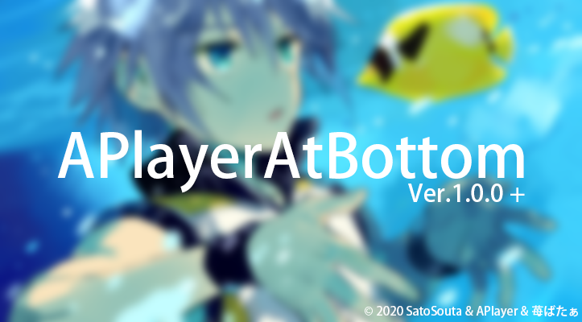

 

<strong>在你的博客底部添加音乐播放器吧</strong>

---

## 特色
 - 支持直接解析网易云音乐歌单（默认提供：[O's API](https://api.ohmyga.cn/page/netease)）
 - 支持自定义播放器主题颜色（作为进度条和音量条的主题颜色）
 - 支持开启自动播放（仅部分浏览器支持）
 - 支持设定默认音量（播放器会记忆用户设置，用户手动设置音量后默认音量即失效）
 - 支持自动更新歌曲缓存，无需手动更新（Ver.1.0.7+）
 - 支持修改网易云音乐获取API（Ver.1.1.0+）

## 使用
1. 下载**最新的 [Release](https://github.com/SatoSouta/APlayerAtBottom/releases/latest)**
2. 解压后，**确认目录名为`APlayerAtBottom`（AP,A,B 大写）**
3. 将文件夹放入 Typecho 根目录下的`usr/plugins/`
4. 到后台启用插件
5. 根据设置中提示来设定插件

## 开源项目
 - [APlayer](https://github.com/MoePlayer/APlayer)（播放器JS）
 - [MetingJS](https://github.com/metowolf/MetingJS)（解析网易云音乐歌单歌曲）

## API支持
 - [O's API](https://api.ohmyga.cn/page/netease)（O's API 网易云音乐解析）

## 相关
 - 演示站点：[我的博客](https://713.moe/)
 - 介绍文章：[APlayerAtBottom - 给博客加上底部播放器吧](https://713.moe/p/135)

---

Copyright &copy; 2020 [小太](https://github.com/SatoSouta) All rights reserved.