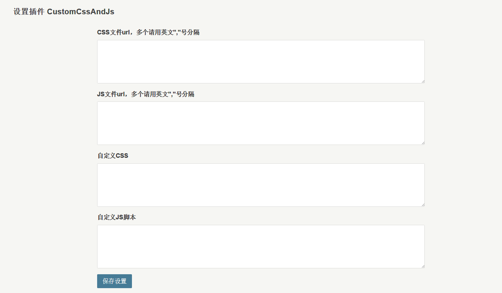

# CustomCssAndJs

## 功能

1. 在文章头部添加 `CSS`
2. 在文章尾部添加 `JS`
3. 在1后面添加自定义 `CSS`
4. 在2后面添加自定义 `JS`

## 使用方法
1. 复制 `CustomCssAndJs` 文件夹到 `Plugins` 文件夹
2. 后台启用插件
3. 到设置面板设置相关配置即可

## 设置面板



## 代码高亮设置
- CSS：`//cdnjs.cloudflare.com/ajax/libs/highlight.js/9.9.0/styles/atom-one-dark.min.css`
- JS: `//cdn.jsdelivr.net/highlight.js/9.9.0/highlight.min.js`
- 自定义JS脚本(参见 [`Highlight.js` 官网](https://highlightjs.org/usage/))：

``` JS
$(document).ready(function() {
  $('pre code').each(function(i, block) {
    hljs.highlightBlock(block);
    //$("pre").css("background",$("code").css("background"));
  });
});
```