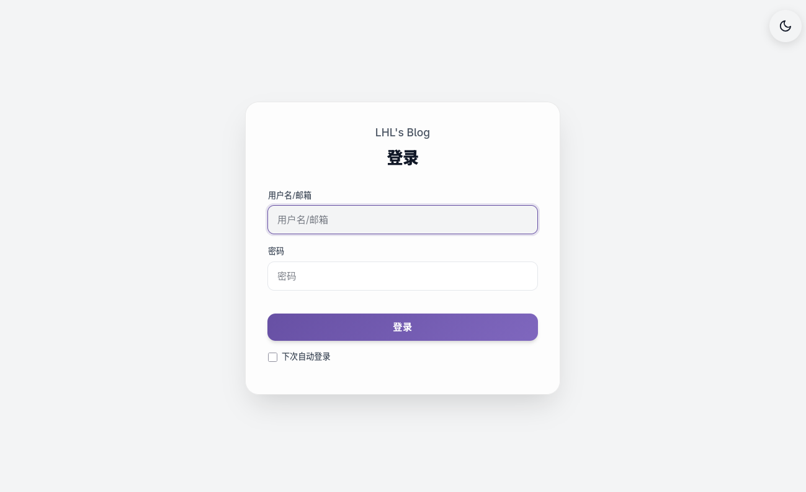
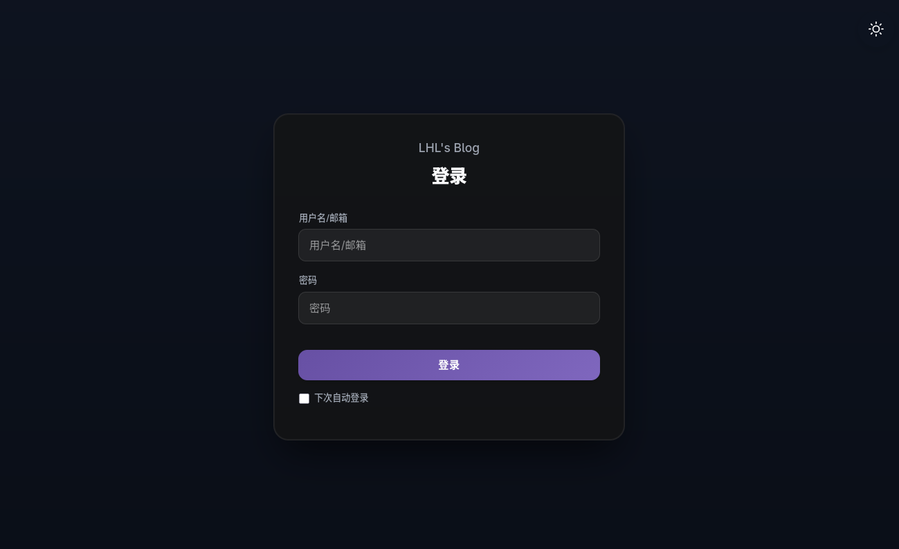
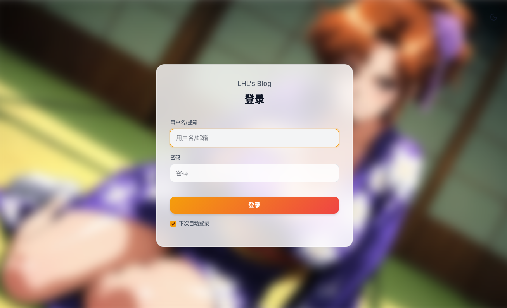
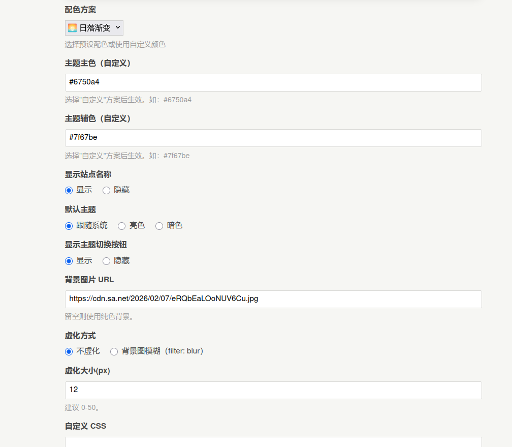
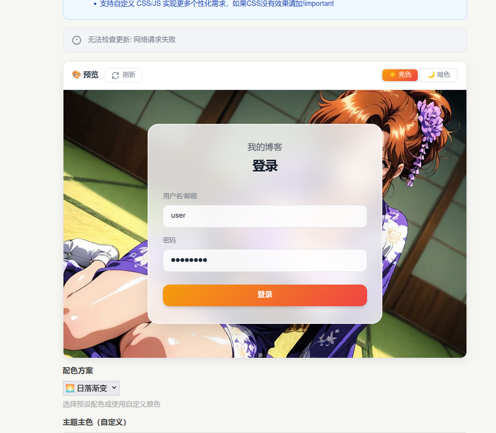

<div align="center">

# 🎨 Login Beautify

**Typecho 登录界面美化插件**

让您的 Typecho 后台登录页面焕然一新

[](https://github.com/lhl77/Typecho-Plugin-LoginBeautify/releases)
[](https://github.com/lhl77/Typecho-Plugin-LoginBeautify/stargazers)
[](https://github.com/lhl77/Typecho-Plugin-LoginBeautify/blob/main/LICENSE)
[](http://typecho.org)

</div>

---

## ✨ 功能特性

- 🎨 **13种预设配色** - 紫、蓝、粉、绿、橙、红、青、靛蓝等多种颜色方案
- 🌓 **深色/亮色主题** - 支持自动跟随系统、手动切换、默认模式
- 🖼️ **自定义背景** - 支持图片背景 + 虚化效果 (filter/backdrop)
- 👀 **实时预览** - 设置页面实时预览效果,所见即所得
- 🎯 **Material 设计** - 遵循 Material Design 设计规范
- 💻 **响应式布局** - 完美适配桌面端和移动端
- ⚡ **轻量高效** - 纯前端实现,无需数据库,不影响性能
- 🔧 **高度自定义** - 支持自定义 CSS/JS 扩展
- 🔄 **自动更新检测** - 自动检测 GitHub 最新版本

## 📦 安装方法

1. 前往 [Releases](https://github.com/lhl77/Typecho-Plugin-LoginBeautify/releases) 下载最新版本
2. 解压后将 `LoginBeautify` 文件夹上传至 `/usr/plugins/` 目录
3. 后台进入「控制台」→「插件」→「启用」插件

## 🎯 使用指南

### 基础配置

1. **选择配色方案**
   - 从 13 种预设配色中选择,或使用自定义颜色
   - 支持主色 + 辅色渐变效果

2. **设置背景图片** (可选)
   - 填入图片 URL
   - 选择虚化方式:不虚化/背景模糊
   - 调整虚化大小 (0-50px)

3. **主题模式**
   - 自动跟随系统 (默认)
   - 固定亮色/暗色
   - 显示/隐藏主题切换按钮

4. **其他设置**
   - 显示/隐藏站点名称
   - 自定义 CSS 样式
   - 自定义 JavaScript 代码

### 实时预览

配置页面提供实时预览功能:
- 🔄 点击刷新按钮更新预览
- ☀️🌙 切换查看亮色/暗色效果
- 📱 自动适配不同屏幕尺寸

## 🎨 预设配色

<div align="center">

| 配色名称 | 主色 | 辅色 |
|:---:|:---:|:---:|
| 🟣 紫 (默认) |  |  |
| 🔵 蓝 |  |  |
| 🌸 粉 |  |  |
| 🌿 绿 |  |  |
| 🍊 橙 |  |  |
| ❤️ 红 |  |  |
| 🌊 青 |  |  |
| 💙 靛蓝 |  |  |
| 🌅 日落 |  |  |
| 🌊 海洋 |  |  |
| 🌲 森林 |  |  |
| 💜 薰衣草 |  |  |


</div>

## 📸 预览展示

### 登录界面

| 亮色模式 | 暗色模式 |
|:---:|:---:|
|  |  |

### 背景效果

| 图片背景 | 图片背景 + 虚化 |
|:---:|:---:|
|  |  |

### 设置页面

| 插件配置页 | 实时预览功能 |
|:---:|:---:|
|  |  |

## ❓ 常见问题

<details>
<summary><b>插件启用后没有效果?</b></summary>

1. 检查插件是否成功启用
2. 清空浏览器缓存后刷新
3. 检查 Typecho 版本是否 ≥ 1.2
4. 查看浏览器控制台是否有 JS 错误
</details>

<details>
<summary><b>自定义 CSS 不生效?</b></summary>

如果自定义 CSS 不生效,请在样式后添加 `!important` 以提高优先级:

```css
.lb-card {
    border-radius: 30px !important;
}
```
</details>

<details>
<summary><b>如何修改登录按钮文字?</b></summary>

在「自定义 JavaScript」中添加:

```javascript
document.addEventListener('DOMContentLoaded', function() {
    var submitBtn = document.querySelector('.lb-submit input[type="submit"]');
    if (submitBtn) {
        submitBtn.value = '立即登录';
    }
});
```
</details>

<details>
<summary><b>背景图片虚化效果对比?</b></summary>

- **filter: blur** - 直接模糊背景图,性能更好,兼容性强
- **backdrop-filter** - 磨砂玻璃效果,更现代,但部分浏览器不支持
- **不虚化** - 保持图片清晰,适合低对比度图片
</details>

<details>
<summary><b>可以使用本地图片作为背景吗?</b></summary>

可以,将图片上传到网站目录后,填写相对路径即可:

```
/usr/uploads/bg.jpg
```

或使用完整 URL:
```
https://your-domain.com/images/bg.jpg
```
</details>

## 🛠️ 技术栈

- **后端**: PHP 7.0+
- **前端**: 原生 JavaScript (无依赖)
- **样式**: CSS3 (CSS Variables + Flexbox)
- **设计**: Material Design 3

## 📝 更新日志

### v1.0.0 (2026-2-7)
- 🎉 初始版本发布
- ✨ 支持 13 种预设配色
- 🌓 深色/亮色主题切换
- 🖼️ 自定义背景图片
- 👀 实时预览功能
- 📱 移动端响应式适配

## 🤝 贡献指南

欢迎提交 Issue 和 Pull Request!

1. Fork 本仓库
2. 创建特性分支 (`git checkout -b feature/AmazingFeature`)
3. 提交更改 (`git commit -m 'Add some AmazingFeature'`)
4. 推送到分支 (`git push origin feature/AmazingFeature`)
5. 提交 Pull Request

## 📄 开源协议

本项目基于 [MIT License](LICENSE) 开源

## 💖 支持作者

如果这个插件对您有帮助,欢迎:

- ⭐ Star 本项目
- 🐛 提交 Bug 反馈
- 💡 提出新功能建议
- 📝 分享使用体验

## 🔗 相关链接

- [Typecho 官网](http://typecho.org)
- [问题反馈](https://github.com/lhl77/Typecho-Plugin-LoginBeautify/issues)
- [作者博客](https://blog.lhl.one)

---

<div align="center">

Made with ❤️ by [LHL](https://github.com/lhl77)

</div>
