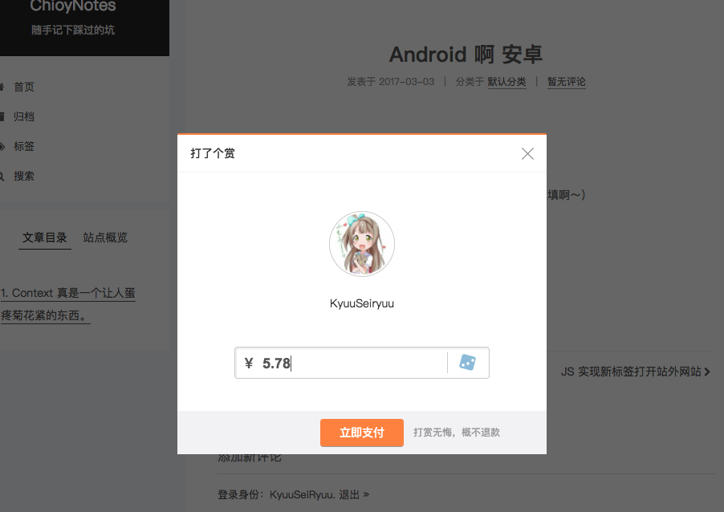
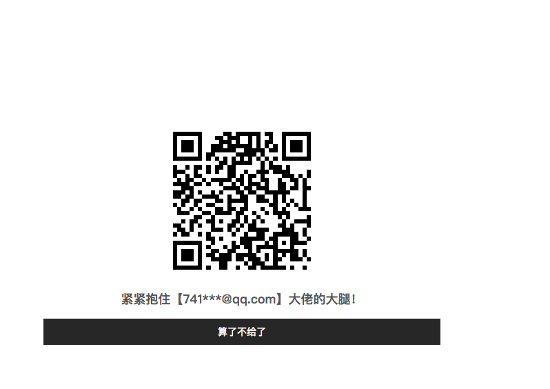
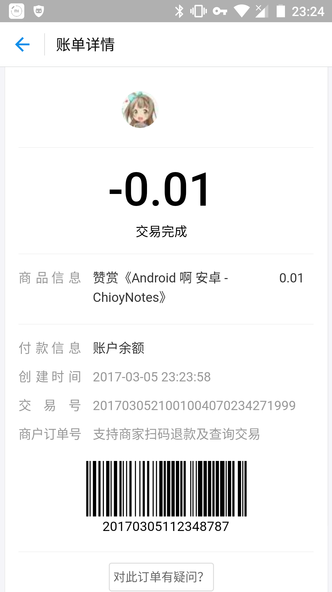

# Reward

## 使用之前
  1. 请先到支付宝 `开通当面付`
  2. 开通当面付后在支付宝 `开发者中心` 配置好密钥

## 使用方式 
  1. 按照支付宝官方文档，将 `Reward/alipay/f2f/config/confg.php` 中的字段正确地填写完整
  2. 拷贝 `Reward` 目录到插件目录 `(usr/plugins)`
  3. 后台启用插件

## 注意事项
  1. 按钮实现方式是在 `文章内容` 追加 `DOM`，所以 *博文末尾* 请务必 *多加几行空行* !
  2. 此插件依赖 `jQuery`,`jQuery.qrcode`插件
  3. `jQuery` 需要 `自己引入`，`jQuery.qrcode` 在插件中已自动引入
  4. 此插件 `支付宝SDK` 版本只支持 `PHP 5.6` 以上

## 效果

### 点击赏按钮后

### 点击支付按钮后

### 等待支付状态

### 取消支付

### 支付完成

### 支付宝订单状态

