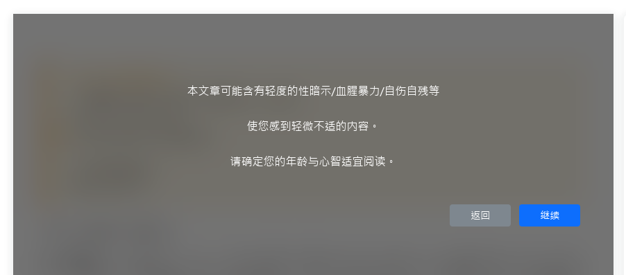
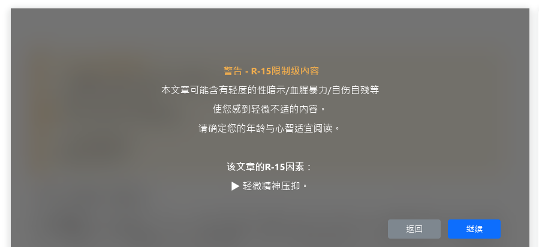

# Spoiler

敏感内容遮罩插件

## 为什么需要这个

敏感内容遮罩可以使用前端 JS 实现，但在 JS 没有完成加载前，内容会短暂显示。

这个插件用 PHP 在后端输出遮罩，避开了这一问题。

## Setup

在主题文件中，插入：

```
<?php \TypechoPlugin\Spoiler\Plugin::smartSpoiler() ?>
```

`smartSpoiler()` 会自动根据当前文章内容，判断是否需要遮罩。

只需把它放在遮挡需要覆盖的范围（一般包括文章和评论区）下，作为子元素。父元素需要是 `position: relative` 的。

## 使用方式

在文章 Markdown 中使用

```
!!!
<!--SPOILER
本文章可能含有轻度的性暗示/血腥暴力/自伤自残等
使您感到轻微不适的内容。
请确定您的年龄与心智适宜阅读。
-->
!!!
```

效果：


另外，如果使用某些主题（已经测试过 Butterfly ），它也能检测页面的 `[note type="warning"]` / `[note type="danger"]` 来自动创建遮罩。

```
[note type="warning flat"] <span style="color:#f0ad4e;">**警告 - R-15限制级内容**</span>
本文章可能含有轻度的性暗示/血腥暴力/自伤自残等
使您感到轻微不适的内容。
请确定您的年龄与心智适宜阅读。

**该文章的R-15因素：**
▶ 轻微精神压抑。
[/note]
```

效果：


实际上，它只检测 HTML 输出中同时拥有 `note` 和 `warning` / `danger` 类的元素，而 Butterfly 等主题会自动输出这些类。

在它们同时存在时，遮罩文案优先级为 `SPOILER注释 > danger > warning` 。

